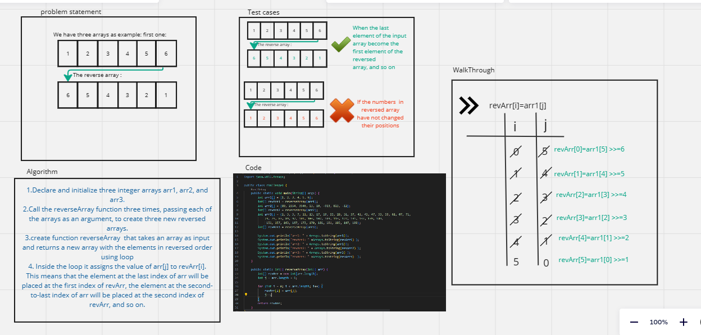
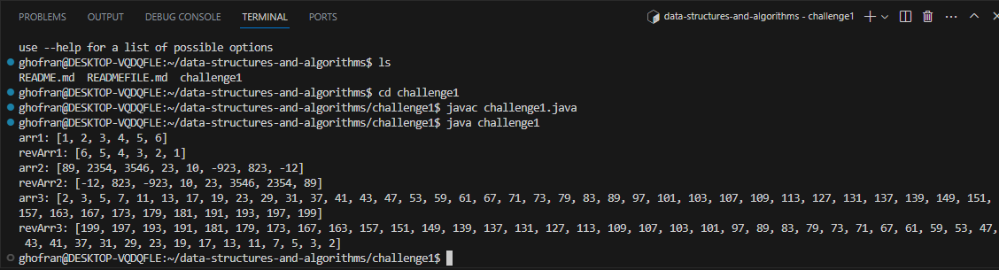

# data-structures-and-algorithms

# Challenge 1
<!-- Description of the challenge -->
## Write code to reverse an arrays
1. initialize three arrays
2. declare function *reverseArray* that take arr and return new reverse array using for loop 
3. last thing print all arrays and reverse arrays

## Whiteboard Process
<!-- Embedded whiteboard image -->

## Approach & Efficiency
<!-- What approach did you take? Why? What is the Big O space/time for this approach? -->
1. The first thing specify the problem (reverse array)
2. Draw simple diagram to understand the idea 
3. Try to write the code for this part 
4. Write the whole code using java language
5. Run the code to be sure is it correct 
6. Drawing the data structure in white board >>this step it take big time 

## Solution
<!-- Show how to run your code, and examples of it in action -->
this the output in the terminal :
