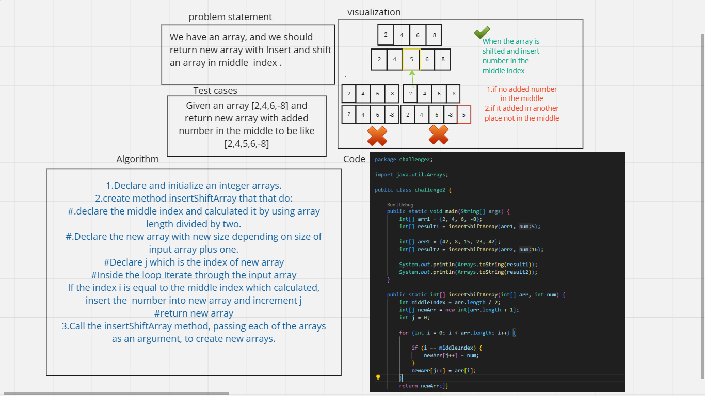
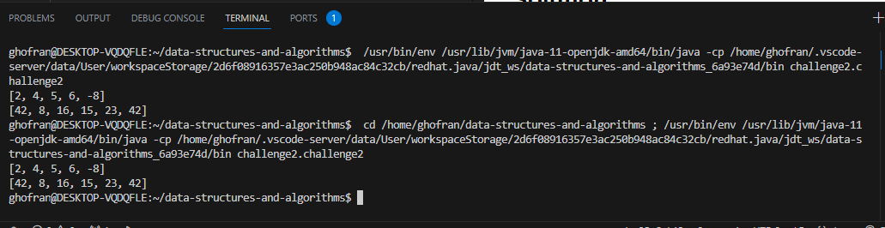

# data-structures-and-algorithms

# Challenge 2
<!-- Description of the challenge -->
## Write code to reverse an arrays
1. Initialize arrays 
2. declare method *insertShiftArray* that take input array  and return new  array with added new element in the middle index. 
3. use for loop to iterate in the input array and return the elements in new array and when the itration index equal the middle index -which calculated from divided input array length into two- , added the new element .
4.call the method to see the results

## Whiteboard Process
<!-- Embedded whiteboard image -->

## Approach & Efficiency
<!-- What approach did you take? Why? What is the Big O space/time for this approach? -->
1. The first thing specify the problem (reverse array)
2. Draw simple diagram to understand the idea 
3. Try to write the code for this part 
4. Write the whole code using java language
5. Run the code to be sure is it correct 
6. Drawing the data structure in white board >>this step it take big time 

## Solution
<!-- Show how to run your code, and examples of it in action -->
this the output in the terminal :
