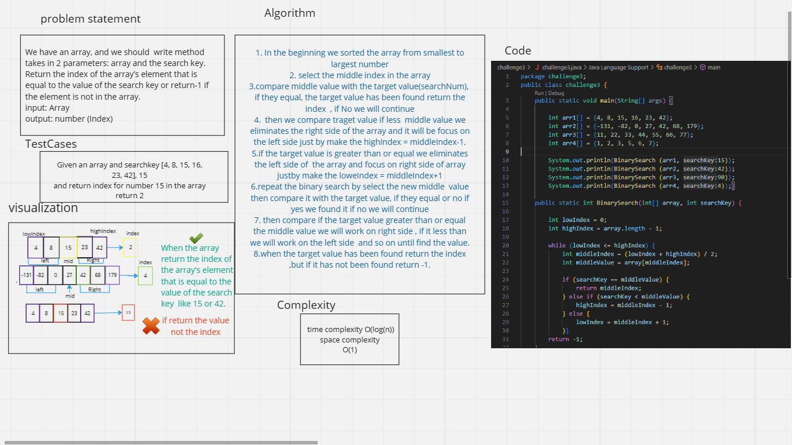
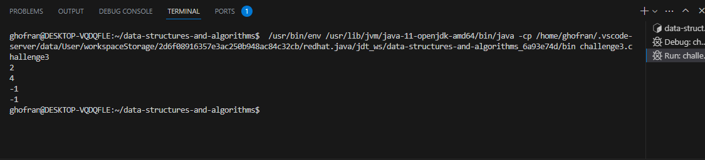

# data-structures-and-algorithms

# Challenge 3
<!-- Description of the challenge -->
## Write code  takes in 2 parameters: a sorted array and the search key.return the index of the array’s element that is equal to the value of the search key or return-1 if the element is not in the array.

1. In the beginning we sorted the array from smallest to largest number 
2. select the middle index in the array 
3.compare middle value with the target value(searchKey),  if they equal, the target value has been found return the index  , if No we will continue
4.  then we compare traget value if less  middle value we eliminates the right side of the array and it will be focus on the left side just by make the highIndex = middleIndex-1.
5. if the target value is greater than or equal we eliminates the left side of  the array and focus on right side of array justby make the loweIndex = middleIndex+1 
6. repeat the binary search by select the new middle  value then compare it with the target value, if they equal or no if yes we found it if no we will continue
7. then compare if the target value greater than or equal the middle value we will work on right side , if it less than we will work on the left side  and so on until find the value.
8. when the target value has been found return the index ,but if it has not been found return -1.

## Whiteboard Process
<!-- Embedded whiteboard image -->

## Approach & Efficiency
<!-- What approach did you take? Why? What is the Big O space/time for this approach? -->
1. The first thing specify the problem (search binary)
2. Draw simple diagram to understand the idea of search key
3. Try to write the code for this part 
4. Write the whole code using java language
5. Run the code to be sure is it correct 
6. Drawing the data structure in white board 

## it take two hours to deal with binary search and draw the white board.

## Time Complexity (O(log n)) 
## Space Complexity (O(1))

## Solution
<!-- Show how to run your code, and examples of it in action -->
this the output in the terminal :
